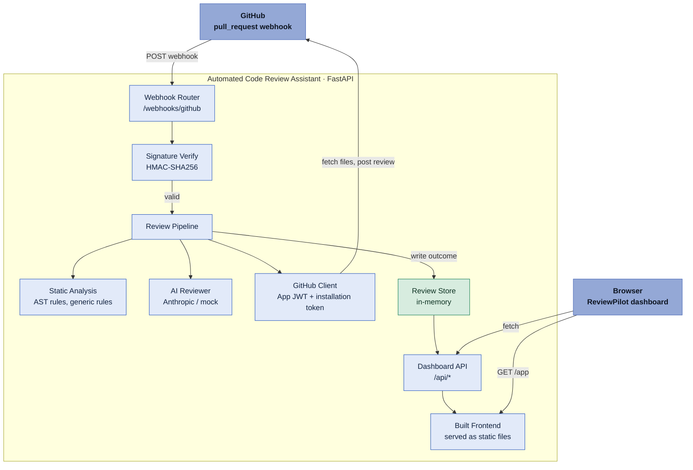
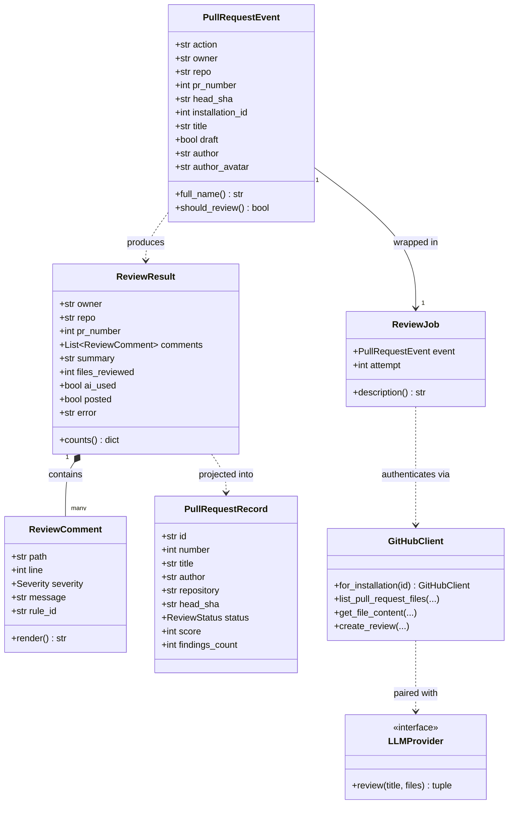
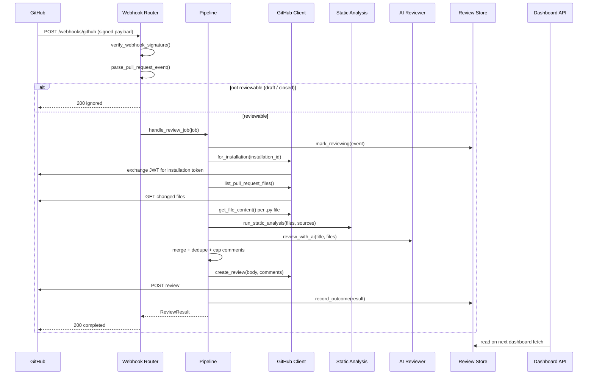

# ReviewPilot — System Diagrams

Three views of the Automated Code Review Assistant: the components a GitHub
pull request passes through, the core data model each one hands off, and the
exact sequence of calls from webhook delivery to a posted review.

GitHub renders the Mermaid blocks below natively when this file is viewed on
github.com.

## 1. Component architecture

One FastAPI service does three jobs: it answers signed GitHub webhooks, it
runs the review pipeline (static rules + an LLM), and it serves both a JSON
dashboard API and the built React frontend from the same origin.

## 2. Core class model

The shapes that carry one review from webhook payload to dashboard row.
`PullRequestEvent` is parsed once at the door; everything downstream reads
from it.

## 3. Webhook-to-review sequence

Runs synchronously inside the request — a deliberate choice for this
deployment (see note below), so the response GitHub sees only returns once
the review is posted.

## Design notes

**Why synchronous** — Deployed on Vercel's serverless Python runtime, which
recycles the process as soon as a handler returns; the original async
background-queue design (`app/queue/`) never got to finish a job. The
webhook now awaits `handle_review_job()` directly instead.

**Auth model** — No personal access token anywhere. The app signs a
9-minute JWT with its private key, exchanges it for a 1-hour installation
token per repository, and caches that token until it's near expiry.

**Dual finding sources** — `ReviewComment` objects come from two
independent producers, AST-based static rules and the LLM reviewer, merged,
deduplicated, and capped at `MAX_COMMENTS_PER_REVIEW` before posting.

---
*Generated from app/models, app/pipeline.py, app/routers/webhooks.py, app/github/auth.py*
